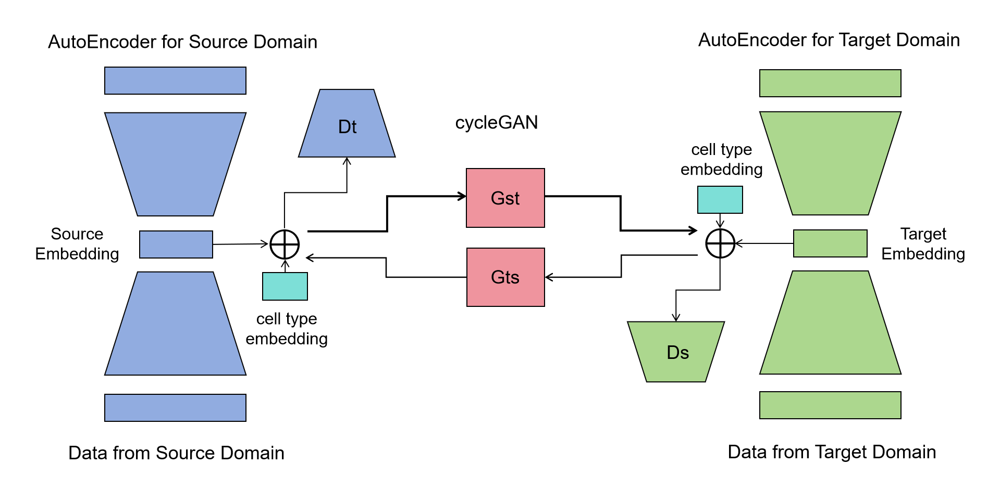

# TenxMap

**TenxMap** is a cycle-consistent generative adversarial network (CycleGAN) framework for cross-platform single-cell transcriptomic domain adaptation. It maps low-quality, low-cost data (e.g., **10x Genomics**, dropout rate > 90%) into the style of high-quality, high-cost data (e.g., **Smart-seq2**), while preserving the intrinsic biological identity of every source-domain cell.

<p align="center">
  
</p>

## Why TenxMap

Single-cell RNA-seq platforms trade off quality against cost:

| Platform | Advantages | Limitations |
|---|---|---|
| 10x Genomics | High throughput, low cost | 3'-end capture, low gene sensitivity, dropout rate > 90%, heavy technical noise |
| Smart-seq2 | Full-length coverage, high gene detection sensitivity | Prohibitively expensive for large-scale studies |

Existing domain adaptation methods focus on global distribution alignment and often **blur cell-type boundaries and lose rare cell populations**. TenxMap instead performs mapping in a compact latent space with multiple constraints, so generated cells both *look like* the target domain (higher quality) and *remain who they are* (source-domain biology preserved).

## Model Overview

TenxMap consists of two stages:

1. **Domain-specific autoencoders (fine-tuned from SCimilarity).**
   [SCimilarity](https://zenodo.org/record/8286452) is a deep-metric-learning single-cell foundation model pre-trained on over 22.7 million cells from 399 studies. Its encoder (FC 1024-1024-1024-128) compresses each gene expression profile into a **128-dim, L2-normalized latent vector** on the unit hypersphere. TenxMap fine-tunes one encoder/decoder pair per domain (source and target), randomly re-initializing only the first and last layers to match the local gene sets.

2. **CycleGAN in latent space with conditional discriminators.**
   Two generators (`G_T2S`, `G_S2T`, MLP + LeakyReLU + BatchNorm) learn the bidirectional latent mapping; two **cell-type-conditional discriminators** distinguish real vs. generated latents conditioned on cell-type embeddings, keeping cell-type boundaries sharp.

Training is a multi-task joint optimization combining:

- **Reconstruction loss** — latent codes stay faithful to the input profiles;
- **Conditional adversarial loss** — generated cells match the target-domain distribution per cell type;
- **Cycle-consistency loss** (latent space + gene space) — bidirectional, reversible mapping without information loss;
- **Content loss** (cosine similarity) — each generated cell keeps the essential expression pattern of its source-domain individual;
- **Style loss** (gene-wise mean/variance matching) — generated data adopt the global statistics of the target domain, i.e., quality elevation;
- **Autoencoder fine-tuning loss** — encoders/decoders are jointly refined during mapping.

## Key Results

### Cross-platform mapping (GSE146771, 10x → Smart-seq2)

TenxMap significantly outperforms existing domain adaptation methods in source-domain information preservation:

| Metric | TenxMap | CoupleVAE |
|---|---|---|
| Leiden ARI | **0.777** | 0.365 |
| Nearest-neighbor preservation | **0.626** | 0.447 |

In batch correction, TenxMap reaches a domain classification accuracy near the ideal 0.5 (0.58-0.60), cell-type classification accuracy of **0.996**, and cell-type silhouette scores of **0.85-0.86** — the best trade-off between batch mixing and identity preservation.

### Temporal data quality enhancement (the decisive experiment)

The time-series experiments most clearly demonstrate TenxMap's superiority: they simultaneously test whether a method **captures and retains source-domain information** (cell identity and continuous developmental structure) and **maps to the target domain** (restoring high-quality signals from degraded input).

Noisy versions of two developmental time-series datasets were enhanced by each method, and Diffusion Pseudotime (DPT) was re-inferred and correlated (Spearman's ρ) with the real time labels:

| Method | E-MTAB-3929 (mouse embryo, E3-E7) | GSE75748 (human ESC differentiation) |
|---|---|---|
| Ground truth (original high-quality data) | 0.835 | 0.897 |
| Noisy input (raw) | 0.771 | 0.706 |
| **TenxMap (ours)** | **0.843** | **0.744** |
| AcImpute | 0.844 | 0.573 |
| MAGIC | 0.635 | 0.322 |
| CoupleVAE | 0.014 | 0.034 |
| scAdapt | 0.029 | 0.187 |

Key observations:

- **CoupleVAE and scAdapt collapse to ρ ≈ 0** — their forced global alignment destroys cell identity and temporal dynamics; scAdapt even introduces band/ring-shaped artifacts that tear the developmental manifold apart.
- **AcImpute and MAGIC over-smooth** — on the noisier GSE75748 their local-neighbor averaging breaks the connectivity of the kNN graph (DPT returns `inf` for many cells), while TenxMap keeps the manifold fully connected.
- **TenxMap recovers the trajectory** — on E-MTAB-3929 it even exceeds the noisy-input baseline (0.843 vs. 0.771) and approaches ground truth, correctly capturing transitions between E5/E6/E7 and the partially synchronized E4-like subcluster in E5, without any artifacts.

This confirms the core design goal: content loss preserves individual source-domain expression differences, while style loss lifts global statistics to the high-quality target domain — no local over-smoothing, no identity loss.

## Repository Structure

```
TenxMap/
├── model/
│   ├── VAE_model_v2.py        # SCimilarity-style autoencoder (Encoder / Decoder / VAE)
│   ├── cycle_gan_celltype.py  # CellMapCycleGAN: conditional Generator + Discriminator
│   └── dataset.py             # CellDataset and variants
├── train/
│   ├── train_map_single_base_mix.py  # Core routines: seed_everything / train_ed / train_map
│   └── generate_map_single_v2.py     # Inference: apply trained mapping to new data
├── train_single.py            # One-command paired training pipeline (10x <-> Smart-seq2)
├── pretrain/
│   └── annotation_model_v1/   # SCimilarity pretrained weights (download from Zenodo, see below)
├── analysis/                  # UMAP visualization, metric plots, temporal generation test
├── analysis_utils/            # Benchmarks: ARI / NNR, SCC-PCC, batch correction, DPT pseudotime
├── data/single_train/         # Input h5ad files (10x and Smart-seq2 per dataset)
└── output_single/             # Training outputs (checkpoints, logs, generated data)
```

## Installation

```bash
# Python 3.10 / 3.11 recommended
pip install torch scanpy anndata numpy scipy pandas matplotlib seaborn umap-learn
```

## Pretrained Model

TenxMap initializes both domain autoencoders from the **SCimilarity** pretrained weights.

- Download: <https://zenodo.org/record/8286452>
- Place the files under `pretrain/annotation_model_v1/` (encoder/decoder checkpoints, `gene_order.tsv`, `layer_sizes.json`, etc.).
- The weights are released by the SCimilarity authors under **CC BY-SA 4.0**; see `pretrain/annotation_model_v1/license.txt`.

## Usage

### 1. Prepare data

Place paired 10x / Smart-seq2 h5ad files (normalized log-expression, with a `celltype` column in `.obs`) under `data/single_train/`, named:

```
data/single_train/<TAG>_10X_10x_immune.h5ad
data/single_train/<TAG>_Smartseq2_smartseq_immune.h5ad
```

### 2. Train

The default dataset tag is `CRC_GSE146771`. Full training typically uses 50 epochs for the 10x autoencoder, 100 for Smart-seq2, and 200 for the mapping model:

```bash
python train_single.py --epochs-t 50 --epochs-s 100 --epochs-map 200 \
    --batch-size-map 512 --lr 2e-3
```

Useful options:

```bash
python train_single.py --tag-t CRC_GSE146771 --run-tag my_run   # custom dataset / run name
python train_single.py --retrain-ae                              # force autoencoder retraining
python train_single.py --latent-dim 128 --cyc-coef 10 --sty-coef 5 --cont-coef 5
```

Outputs (autoencoder checkpoints, mapping model checkpoints, logs) are organized under `output_single/<run_tag>/`. Training is reproducible via `--seed` (default 42) and runs on GPU (`cuda:0`) when available, otherwise CPU.

### 3. Generate / map new data

Use `train/generate_map_single_v2.py` to load trained autoencoder and mapping checkpoints and generate Smart-seq2-style profiles from 10x input (and vice versa, bidirectionally).

## Citation

If you use TenxMap, please cite the thesis:

> Tang Xin. *Generation Method for Single-Cell Transcriptomic Data Based on Generative Adversarial Networks and Its Application*. Master's thesis, South China University of Technology, 2026. (Supervisor: Prof. Hongli Du)

And the pretrained foundation model:

> SCimilarity — a large-scale single-cell foundation model pre-trained on 22.7M+ cells from 399 studies. Weights: <https://zenodo.org/record/8286452>

## License

- The SCimilarity pretrained weights are licensed **CC BY-SA 4.0** (`pretrain/annotation_model_v1/license.txt`).
- Benchmark datasets: GSE146771, GSE140228, E-MTAB-3929, GSE75748 (public repositories, respective licenses apply).
